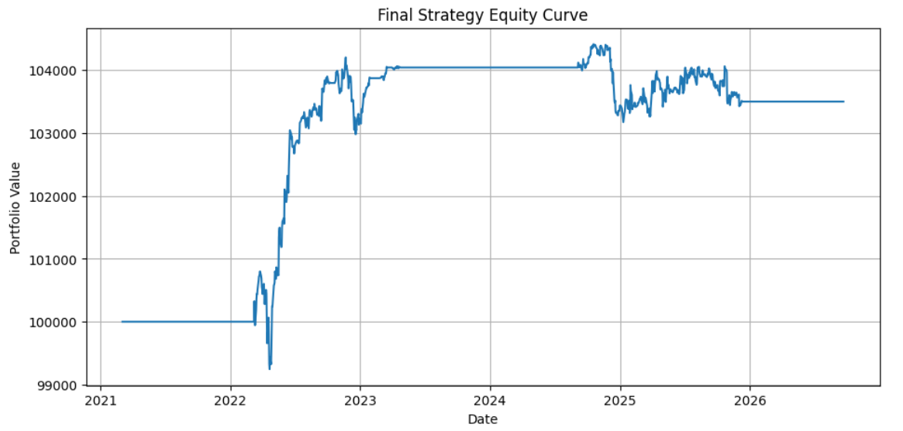
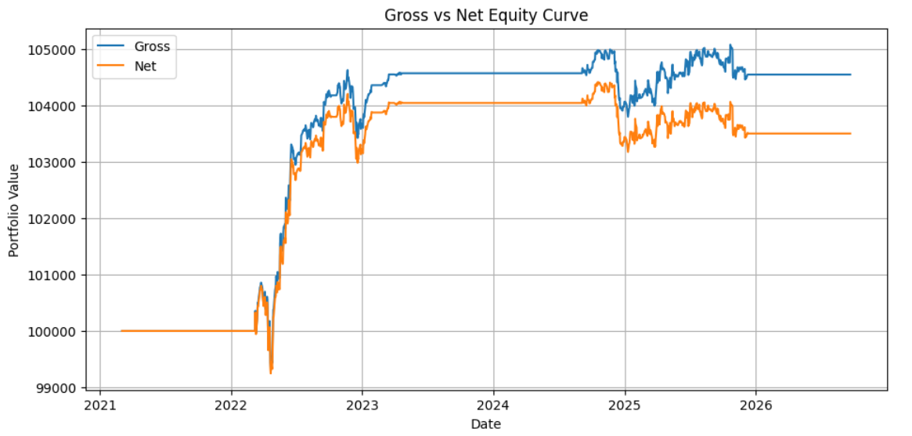
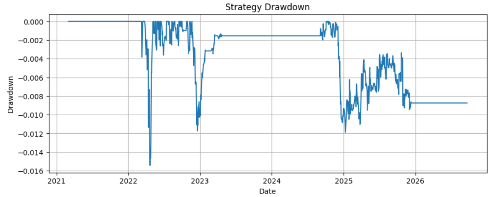
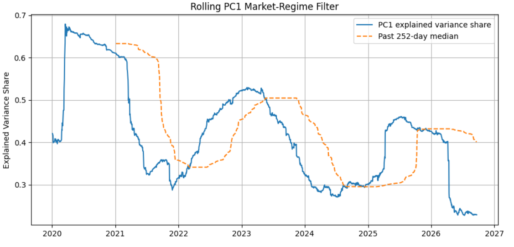
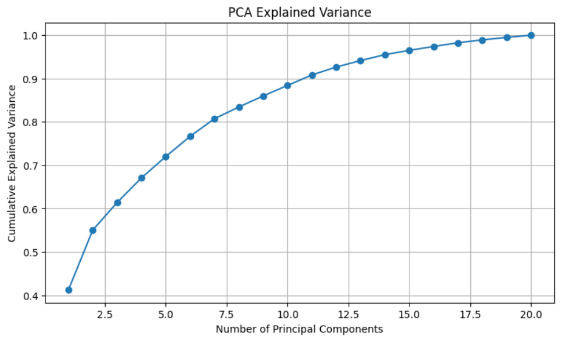
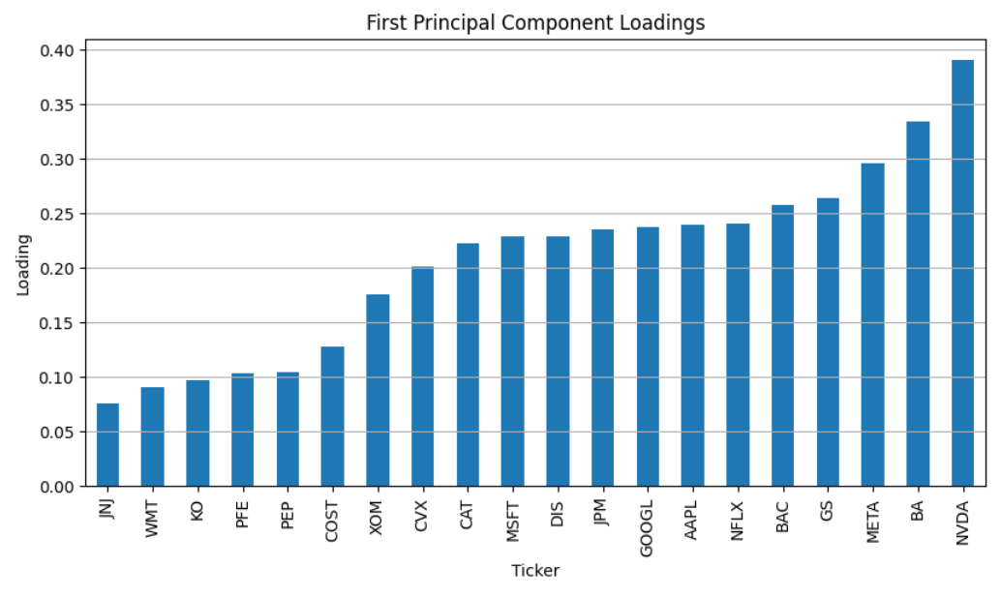
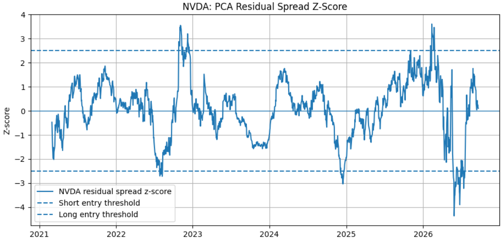

# Market Factor Modeling & Statistical Arbitrage

PCA-based statistical arbitrage research on a universe of 20 U.S. equities.

The idea is to separate common market movements from stock-specific residuals, trade extreme residual deviations, and remove exposure to the same PCA factors used to construct the signal.

The backtest is fully walk-forward: rolling PCA, signal statistics, and regime thresholds use past data only.

## Results

Final specification:

| Metric | Result |
|---|---:|
| Cumulative return | 3.50% |
| Annualized volatility | 1.06% |
| Sharpe ratio | 0.59 |
| Max drawdown | -1.54% |
| Average daily turnover | 0.72% |
| Transaction costs | 1.01% |

The first principal component explains about **41.2%** of total variance.  
The first six principal components explain about **76.7%**.

## Equity Curve



Transaction costs have a visible effect, but do not fully remove the strategy's gains.



## Drawdown



Maximum drawdown in the final backtest is approximately **-1.54%**.

## PC1 Regime Filter

The strongest improvement came from conditioning new trades on market factor structure.

For each day, define the PC1 explained-variance share:

```math
m_t=\frac{\lambda_{1,t}}{\sum_j \lambda_{j,t}}
```

New positions are allowed only when the current PC1 share is above the median of its previous 252 observations.



Ablation:

| Metric | No Regime Filter | PC1 Filter |
|---|---:|---:|
| Cumulative return | -1.24% | 3.50% |
| Sharpe ratio | -0.13 | 0.59 |
| Max drawdown | -4.49% | -1.54% |
| Average daily turnover | 1.69% | 0.72% |

Existing positions are not closed when the regime changes; the filter only blocks new entries.

## PCA Model

Returns are centered and PCA is fitted on a rolling 252-day window.

For the first \(k\) principal components,

```math
Q_k=[v_1,\ldots,v_k]
```

the PCA residual is

```math
e_t=(I-Q_kQ_k^\top)(x_t-\mu_t)
```

The final model uses **6 principal components**.

### Explained Variance



### PC1 Loadings



PC1 has same-sign loadings across the universe, so it behaves like a broad common market direction.

## Trading Signal

Residuals are accumulated over a 40-day horizon:

```math
s_t=\sum_{j=0}^{39}e_{t-j}
```

The spread is standardized using the previous 252 observations:

```math
z_t=\frac{s_t-\mu_t}{\sigma_t}
```

Entry rule:

- `z < -2.5` → long
- `z > 2.5` → short

Positions exit when the signal crosses back through zero or after 40 trading days.

Example for NVDA:



## Factor-Neutral Portfolio

Raw signal weights can still contain exposure to the retained PCA factors.

The portfolio is projected onto the orthogonal complement of the PCA factor space:

```math
w=(I-Q_kQ_k^\top)w^{raw}
```

Therefore, immediately after neutralization,

```math
Q_k^\top w=0
```

This acts as the factor hedge. The final model does not use a separate SPY hedge.

## Backtest Setup

| Parameter | Value |
|---|---:|
| PCA window | 252 days |
| Principal components | 6 |
| Residual horizon | 40 days |
| Z-score window | 252 days |
| Entry threshold | 2.5 |
| Max holding | 40 days |
| Max positions | 10 |
| Position size | 5% |
| Max gross exposure | 50% |
| Transaction cost | 10 bps |
| PCA rebalance interval | 20 days |

The timing is:

```text
past data
→ fit PCA
→ observe today's signal
→ build today's portfolio
→ apply weights to next-day returns
```

This avoids look-ahead bias.

## Alternative Specifications

I also tested:

- empirical quantile thresholds instead of z-scores;
- an AR(1) mean-reversion filter;
- different portfolio concentration levels;
- different residual horizons.

The AR(1) filter did not improve results.

Empirical quantiles produced more turnover and lower risk-adjusted performance than the final z-score specification.

## Robustness Limitation

The main weakness is sensitivity to the residual horizon:

| Residual horizon | Sharpe |
|---:|---:|
| 30 | -0.03 |
| 40 | 0.59 |
| 50 | 0.05 |
| 60 | -0.03 |

The isolated performance at 40 days suggests possible parameter overfitting.

The results should therefore be treated as **exploratory**, not as evidence of a stable trading alpha.

## Repository Structure

```text
.
├── notebooks/
│   ├── 01_pipeline.ipynb
│   ├── 02_residual_diagnostics.ipynb
│   └── 03_final_research_results.ipynb
├── src/
│   ├── data.py
│   ├── pca.py
│   ├── residuals.py
│   ├── signals.py
│   ├── portfolio.py
│   ├── backtest.py
│   └── metrics.py
├── docs/
├── figures/
├── README.md
└── requirements.txt
```

The main notebook is:

[`notebooks/03_final_research_results.ipynb`](notebooks/03_final_research_results.ipynb)

Detailed mathematical notes are available in:

[`docs/README.md`](docs/README.md)

## Run

```bash
pip install -r requirements.txt
jupyter lab
```